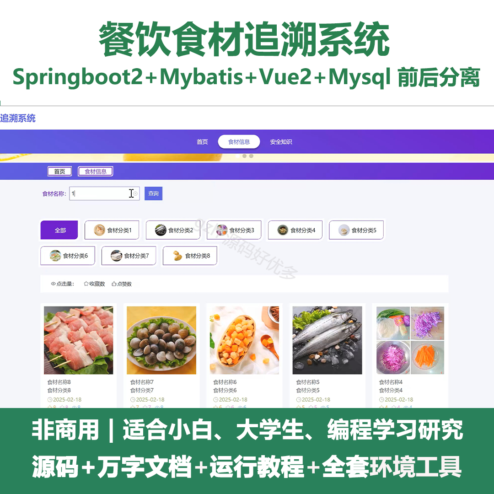
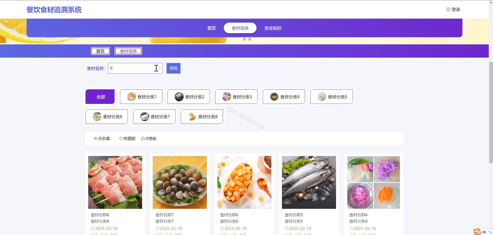
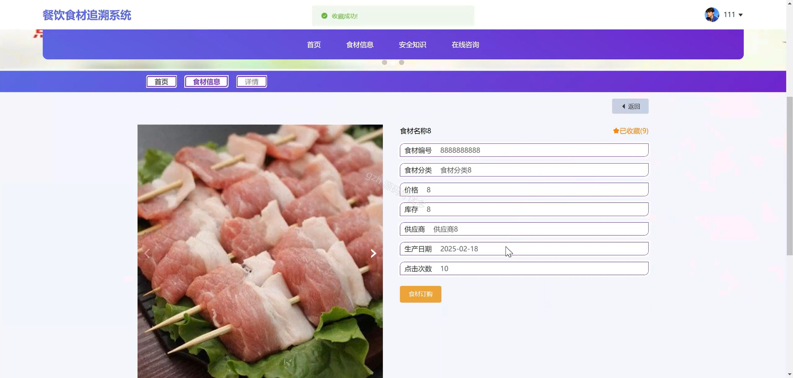
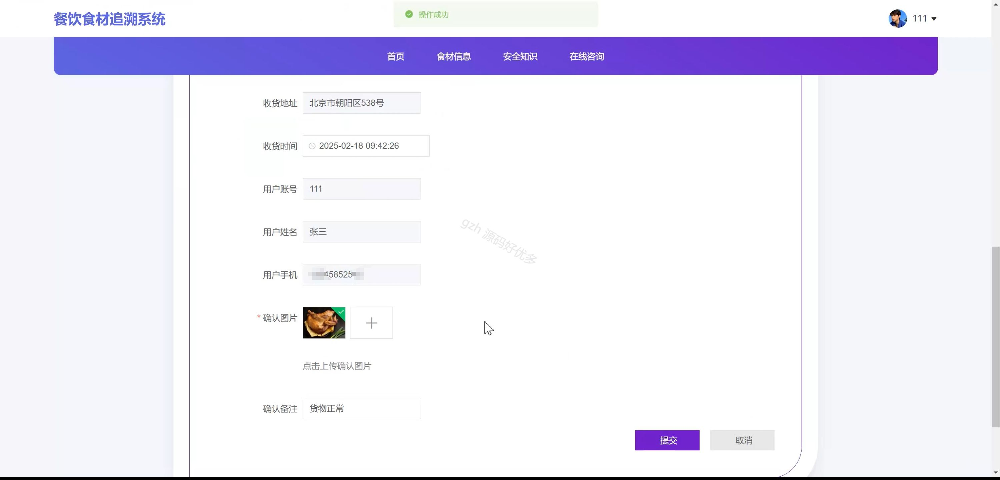
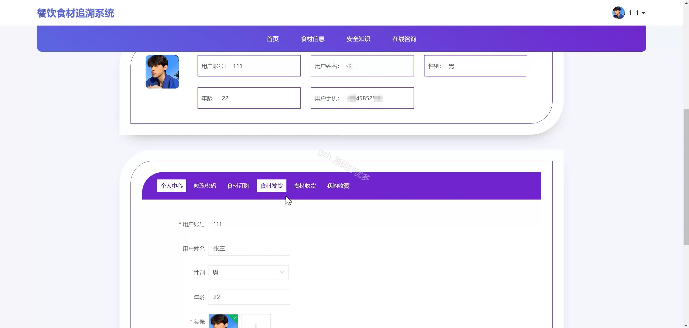
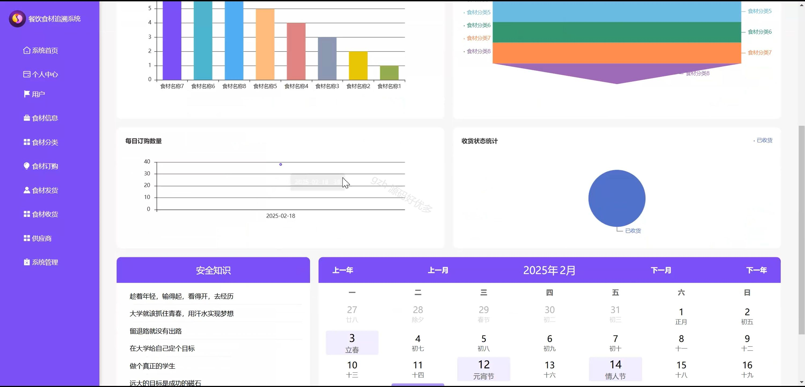
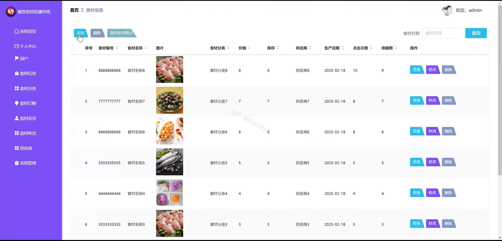
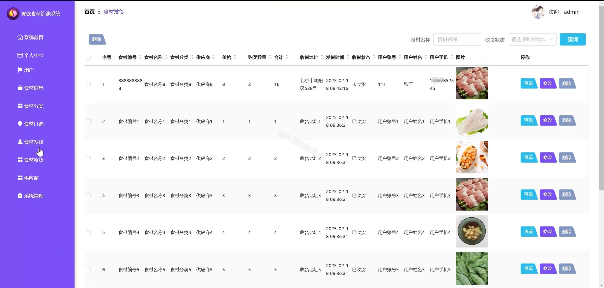
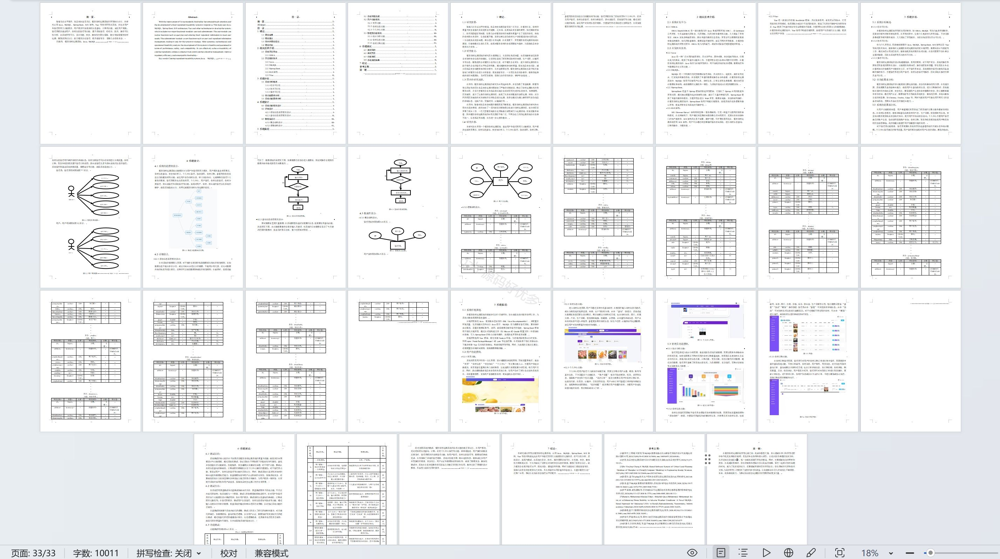

# springbootA273D
springbootA273D餐饮食材追溯系统+LW
 
## 查看主页获取源码

### 一、关键词
食材信息、食材订购、食材发货

### 二、作品包含
源码+数据库+设计文档万字+全套环境和工具资源+本地部署教程

### 三、项目技术
前端技术：Html、Css、Js、Vue2.0、Element-ui 
后端技术：Java、SpringBoot2.0、MyBatis

### 四、运行环境（以下版本亲测，其他版本未知，请自测）
开发工具：IDEA/eclipse  + VSCODE

数据库：MySQL5.7（最低要5.7版本）

数据库管理工具：Navicat10以上版本

环境配置软件： JDK1.8 + Maven3.6.3

前端Nodejs：14

浏览器：谷歌浏览器

### 五、项目介绍
项目编号：springbootA273D

餐饮食材追溯系统能实现食材从源头到餐桌全流程信息的追踪与溯源，保障食品安全、提升供应链透明度并便于问题责任界定。

角色：管理员、用户

用户功能：首页、食材信息、安全知识、个人中心、修改密码、食材订购、食材发货、食材收货、我的收藏。

管理员功能：系统首页、个人中心、用户、食材信息、食材分类、食材订购、食材发货、食材收货、供应商、系统管理。

### 六、运行截图

